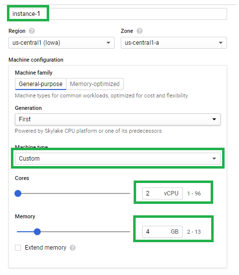

# Google Cloud

To launch your Google Cloud instance, we will go through 2 steps.

**Step 1: Launching your Google Cloud Instance**

* Registering Google Cloud and choosing the correct instance.

**Step 2: Connecting to your Google Cloud Instance** 

* Connecting to your Google Cloud instance 

## Step 1: Launching your Google Cloud Instance <a id="step-1-launching-your-google-cloud-instance"></a>

Go to [https://cloud.google.com](https://cloud.google.com/) and click on “Get Started for Free” if you don’t have an account yet or on “Sign in” if you already have a Google Account. If you haven’t used Google Cloud yet, you will get a $300 USD dollars credit for 1 year!

After you login and validate your credit card, you will be shown a page pretty much like this one. Click on “Compute Engine” and then in “VM Instances”.


Click on the Create button to make a new instance


We recommend to name it something like "pangaea” \(the instance name cannot be changed\). Select the Machine type as “Custom” and set up 2 vCPU’s and 4GB of Memory.

 



For Pangaea, keep everything default after you have configured the cores and memory. Pangaea with 10GB is perfectly fine for now.


Click Create. Please wait a few minutes for your instance

Once the instance is created. We will open 4 ingoing ports. To do this click on "nic0" as shown below. In the next page click on “Firewall rules” and after that on “CREATE FIREWALL RULE”.


* TCP 6000
* TCP 9000


Now go back to the VM instances page and click on SSH. This will open a new window and connect via SSH to your instance.


## **Step 2: Connecting to your Google Cloud Instance and copying keys**



\*\*\*\*

You will be thrown to the ssh session with your default user. We will have to first make a password for yourself to change to root user. To do so, enter in

```text
sudo passwd
```

Once you have done that, to enter into root mode enter in

```text
su
```

This command will then ask you for your password from the step above. When entered correctly it will show you as root user.


Before anything is recommended to update your system

```text
apt update && apt upgrade
```

Now install the following packages that will be needed to run Harmony by typing:

```text
apt-get install dnsutils
apt-get install tmux
```

You will be asked to confirm if you would like to download and install these packages. Just press Y to confirm.

